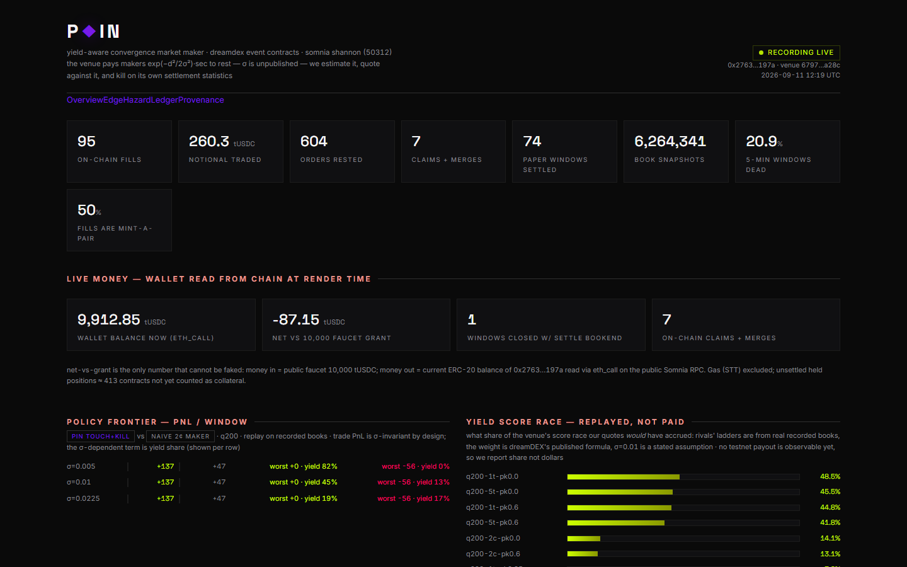

# PIN — Yield-Aware Convergence Market Making on DreamDEX Event Contracts



**The venue pays makers to rest liquidity and never publishes the rulebook's key parameter.**
dreamDEX distributes collateral yield to resting orders by
`score = qty × exp(−(P−mid)²/2σ²) × seconds` (docs: Collateral Yield Algorithm). σ is set
per market on-chain and is **not exposed by any API or SDK** — the official bot-kit requires
operators to hand-set `YO_SIGMA_RAW`. 80 hackathon projects traded this venue; none mentions
this mechanic. PIN is the first market maker whose objective function contains it.

**Live monitor:** https://samixrd.github.io/pin-dreamdex/ — regenerated from the live VM stack every
15 min (tx hashes link straight to the Shannon explorer; wallet cards read on-chain via `eth_call`)

```
fund → mint-a-pair two-sided bids at d from mid → accrue yield score per second (W-banded)
     → pin-hazard kill (empirically calibrated) → flatten before settle → redeem → decompose
```

## What PIN is

A zero-inventory, two-sided maker for DreamDEX Event Contracts (binary Up/Down price windows
on Somnia) that:

1. **Quotes geometry from the venue's own yield formula.** Resting distance is chosen against
   the Gaussian weight band, not a fixed spread. Measured on recorded books: at the incumbent
   ladder's quote size, touch-adjacent quoting captures **22–88% of the book's total yield
   score** (band-dependent) vs **0.1–19%** for the standard ±2¢ maker — a 300× gap at narrow σ,
   still 1.5×+ and $-positive at the band the incumbents' own geometry implies (σ ≈ 0.014, ML over 1.88M snapshots).
2. **Carries a kill rule calibrated on the venue's settle distribution, not textbook BM.**
   From 52 days / 146k-candle rail over 100+ validated windows: **67% of windows finish
   within 1σ of their opening line** — pin risk is the modal outcome. The guard fires on
   P(settle within 10bp of line) > 0.35, computed from an empirical hazard table learned
   from the venue's own settlements (`data/hazard_table.json`).
3. **Publishes the decomposition, not a PnL number.** Every window settles into
   spread captured + yield score share − adverse selection (30s markout per fill) − pin
   losses, live on the dashboard. Losses included. Window #1 lost −208.5 paper tUSDC and the
   post-mortem (stale price rail disarming the kill) is in the ledger.

## Evidence, all measured on Shannon testnet (chain 50312)

| Claim | Source |
|---|---|
| 20.3% of 364 recorded markets never traded; of 261 five-minute windows, 23% died | `data/published/venue_anatomy.json` |
| Median traded market has **one maker taking 100% of maker volume**; 49% of fills are mint-a-pair (no sellers exist) | per-market fill ladders w/ maker addresses |
| Oracle resolves outcomes that public 1-min feeds **cannot reproduce**: 100% agreement ≥25bp from the line, 64% at 5–10bp, 36% <2bp | `analyze3.py`, 136-window test |
| Adverse selection has **3 regimes**: touch pays −1.5¢ markout, 1–2¢ band *earns* +1.8¢ (trend flow), ≥3¢ turns toxic (33–47% loss tails) | 2,170 reconstructed maker fills |
| σ — the venue's unpublished band — estimated from 1.88M book snapshots: incumbent ladders rest 1.3¢ median / 1.5¢ p95 off mid ⇒ **σ ≈ 0.013–0.015** (max-likelihood floor inversion; v1 range [0.005, 0.0225] tightened) | `sigma_est2.py`, `data/published/sigma_est_v2.json` |
| Policy frontier (q200): **touch + hazard-kill(0.6) = +136.7 mean, worst window 0.0, 81.5% yield share** (σ=0.005) vs naive-2¢ **+46.8, worst −56.4, 0.2%** | `sweep_final.py`, `data/published/sweep_final.json` |
| Empirical pin hazard: P(settle ≤10bp from line) = 47–59% right after open, dropping to 3% once 2bp√min of escape — the kill rule is *calibrated on this table*, not on textbook BM | `data/published/hazard_table.json` |
| Live money: 339 ledger events — orders placed, filled (incl. NO at 0.012 during a crash-through), flattened, merged, redeemed, all with tx hashes on Shannon | `data/published/live_ledger.json` |

## Layout

```
--- always-on (Azure VM) ---
collector.ts    read-only recorder: books (5-level, ~2s), fills, settlements, px marks
paper.py        live shadow trader on the collector's stream (same policy objects)
live.ts         real-money runner: on-chain status gate, post-only bids, expire-ts dead-man,
                hazard kill, pre-settle flatten, redeem + claim sweep; caps: 60/window, 200 total
publish_pages.sh + crontab: dashboard regen -> docs/ -> GitHub Pages (every 15 min)
--- offline analysis (anywhere, run against the recorded data) ---
backfill.ts     historical market+fill sweep (resumable, indexer-503-hardened)
pxdeep.py       52-day oracle price feed dump (1m candles, close + EMA mark, raw precision)
pin_core.py     replay engine: order lifecycle, mint-a-pair fills, yield-score race, markout
sweep2/3/sweep_final  policy grids: distance × kill × σ band × quote size
hazard.py       empirical P(pin | normalized state) table from venue settlements
sigma_est2.py   ML band estimate from 1.88M resting-ladder observations
dashboard.py    regenerates data/dashboard.html from ledgers + live eth_call (zero synthetic data)
publish.py      writes compact artifacts to data/published/
```

## Run — 24/7 stack (the Azure VM)

The live engine runs on a small Ubuntu 24.04 VM under pm2 (restart-on-fail, survives reboots);
the laptop is never required.

```bash
ssh azureuser@<vm>              # node 18 + python 3.12
cd ~/pin && npm i

pm2 start "npx tsx collector.ts" --name pin-collector --time
pm2 start "python3 paper.py"     --name pin-paper
LIVE_DRY=0 LIVE_MAX_WINDOWS=200 pm2 start "npx tsx live.ts" --name pin-live
pm2 save                         # resurrect on boot

# wallet key at data/pin_key.txt (64-hex, chmod 600) — dedicated burner, never the main key.
# funding is self-serve: public faucet(uint256) 10k tUSDC + a small STT transfer.

# GitHub Pages publish path: repo deploy key at ~/.ssh/id_deploy, Host github.com block in
# ~/.ssh/config, and crontab:
crontab -l
# */15 * * * * /home/azureuser/pin/publish_pages.sh >> /home/azureuser/pin/data/pages.log 2>&1
```

Safety rails baked into live.ts: per-window cap 60 tUSDC, cumulative cap 200, wallet balance
floor 9,700 (hard halt), order expiry = window close (dead-man), venue+on-chain-status gate
before every write.

## Run — fresh from a clone (analysis + local replay)

The raw recording corpus (1.4 GB of order-book/fill tape) is gitignored; the committed
`data/published/*.json` artifacts are what the claims cite, so **the judge path works on a
bare clone**. To re-derive the analyses from source yourself, first generate or copy the tape:

```bash
npm i
# option A — record fresh (needs hours of collector on a live venue):
npx tsx collector.ts &
# option B — pull the VM's tape:  scp azureuser@<vm>:~/pin/data/\*.jsonl data/
# option C — reconstruct history only (no books → sigma/hazard/sweep stay data-limited):
python pxdeep.py                                 # 52-day price rail
npx tsx backfill.ts 30                           # settled markets + maker fills

python publish.py                                # compact JSON artifacts
python sigma_est2.py && python hazard.py         # band estimate + kill calibration
python sweep_final.py                            # policy frontier (replay)
LIVE_DRY=1 npx tsx live.ts                       # dry-run the money path
python dashboard.py                              # local render of the monitor
```

Testnet tUSDC is self-serve: public `faucet(uint256)` on the token, 10k/call (no Telegram needed).

## Verify it yourself (judge path — no trust required)

Everything below is checkable from the public repo + public chain in ~10 minutes.

```bash
git clone https://github.com/samixrd/pin-dreamdex && cd pin-dreamdex

# 1. MONEY IS REAL. The dashboard's wallet card is a live eth_call, and every ledger
#    tx hash resolves on the public Shannon RPC:
python reality_check.py        # reads data/live_ledger.jsonl, verifies receipts on-chain
# or manually, with any hash from the ledger:
curl -s https://api.infra.testnet.somnia.network -H 'content-type: application/json' \
  -d '{"jsonrpc":"2.0","id":1,"method":"eth_getTransactionByHash",
       "params":["<paste-a-hash-from-data/published/live_ledger.json>"]}'
#    -> "from": 0x27633fEC5EdA3F0298BfFa24018dAf54dd18197A  (PIN's own burner wallet)
#    -> block, gasUsed, status 0x1. Or click any hash in https://samixrd.github.io/pin-dreamdex/

# 2. NO SYNTHETIC NUMBERS. Every published figure regenerates from raw files:
python publish.py && python dashboard.py && python audit.py
#    audit.py cross-checks each dashboard value against its source file AND spot-checks a
#    random tx hash against the public RPC (sender must equal the PIN wallet). 24 checks.

# 3. THE CLAIMS ARE REPRODUCIBLE FROM PUBLIC VENUE DATA:
python pxdeep.py && npx tsx backfill.ts 30      # re-record the rail + settlement history
python sigma_est2.py                            # σ ≈ 0.013–0.015 re-emerges from books alone
python hazard.py && python sweep_final.py       # hazard table + frontier re-derive

# 4. THE YIELD MECHANIC IS NOT OUR INVENTION:
#    https://docs.dreamdex.io/trading/common/yield-algorithm  (the exp(−d²/2σ²) score, and
#    "no early-cancel penalty")  vs  https://github.com/somnia-chain/dreamdex-bot-kit
#    (packages/core/src/yield.ts + strategies/yield-optimizer/README.md: σ is not queryable,
#    operators hand-set YO_SIGMA_RAW, and that whole half exists only for SPOT — not EC).

# 5. NOTHING CRITICAL IS PUBLIC:
python secretscan.py
#    scans every tracked file + all git history for private keys, hostnames, IPs, cloud IDs,
#    tokens. Allow-lists 0x-prefixed on-chain hashes (public by nature). Expect: zero hits.
```

What we deliberately do NOT claim: no testnet OI-yield payout is observable yet, so the
"yield score race" section reports *share of the race*, replayed from real books — never
dollars. Trade PnL on the frontier is replay; live PnL is the wallet delta (net-vs-grant card).

## Security notes

- `live.ts` only ever reads a key from `PIN_KEY_FILE` / `data/pin_key.txt` (gitignored, chmod 600).
  No key, IP, hostname, cloud project ID, or token appears in tracked files or git history —
  `secretscan.py` enforces it. The deployed monitor shows a truncated public address only.
- Hard rails are compiled in, not env-tunable: 60 tUSDC/window, 200 cumulative, wallet balance
  floor (halt), mandatory `expireTimestampNs`, post-only, venue + on-chain-status gate.
- `.env.example` documents every knob (all read from the shell environment — no dotenv).
  Copy to `.env` and load with `set -a; . ./.env; set +a`, or pass inline. The repo never
  contains `.env`. RPC/indexer endpoints are compiled in, not env-tunable.

## Feedback report

See `FEEDBACK.md` — five verified SDK/docs traps we hit building this (all reproducible).

MIT. Data and receipts are the product; fork the engine, not the claims.
